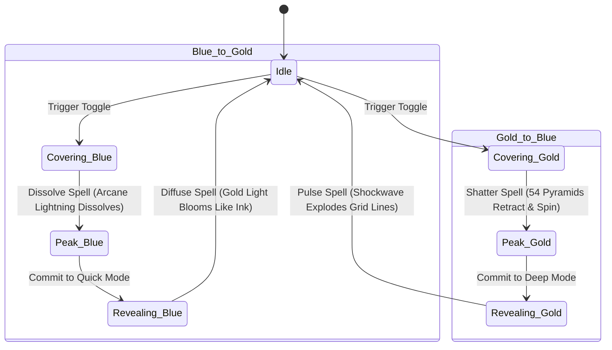

# Specification: Lume-Glass Cinematic Page Transitions & Core Stabilization

This document outlines the design, architecture, and implementation plan for the cinematic transitions between the Bento Grid and the Detail Pages, as well as the screen-wide Core Stabilization mode toggle.

---

## 1. Architectural Architecture & Store Extensions

We will extend the Zustand navigation and view-mode stores to capture spatial coordinates and synchronize animation play states across 2D canvas layers, 3D WebGL modules, and HTML DOM elements.

### 1.1 Store Adjustments
We will update [useNavigationStore.ts](file:///C:/Projects/Portfolio/store/useNavigationStore.ts) to include the layout coordinates of bento tiles during transition initiations:

```typescript
export interface OriginRect {
  left: number
  top: number
  width: number
  height: number
  right: number
  bottom: number
}

interface NavigationStore {
  originTileId: string | null
  setOriginTileId: (id: string | null) => void
  originRect: OriginRect | null
  setOriginRect: (rect: OriginRect | null) => void
  bentoTilesBounds: Record<string, OriginRect> | null
  setBentoTilesBounds: (bounds: Record<string, OriginRect> | null) => void
  curtainState: "idle" | "covering" | "revealing"
  setCurtainState: (state: "idle" | "covering" | "revealing") => void
}
```

---

## 2. Quick Pitch Mode (Mel’s Magic • Golden Theme)

The transition must feel like a painting coming to life, using organic, liquid-gold brush textures and thin, floating geometric lines.

### 2.1 Grid-to-Page Transition: The Golden Canvas Brush
*   **Clicked Tile Expansion**: On click, the chosen [BentoTile](file:///C:/Projects/Portfolio/components/bento/BentoTile.tsx) scales up to fill the viewport using GSAP fixed-position interpolation.
*   **SVG Brush Mask**: We will inject a hidden inline SVG `<mask>` containing a custom vector fluid brush stroke path in [DetailShell.tsx](file:///C:/Projects/Portfolio/components/detail/DetailShell.tsx). 
*   **Unmasking Reveal**: The main content wrapper of the detailed page will use:
    ```css
    mask-image: url(#brush-mask);
    -webkit-mask-image: url(#brush-mask);
    mask-size: 100% 100%;
    ```
    GSAP will animate the SVG path's scale and width from the clicked tile's center outward to "paint" the detailed page into view during the `revealing` phase.
*   **Shimmer Overlay**: Concurrently, [PageEntryOverlay](file:///C:/Projects/Portfolio/components/layout/PageEntryOverlay.tsx) paints a fluid, radial gold ink wash that expands outward, leaving a trail of drifting gold-leaf shimmer particles.

### 2.2 Typography Reveal: Gilded Headers
*   **Blur-to-Focus Fade**: Text blocks will fade in staggered using GSAP:
    ```javascript
    gsap.fromTo(".reveal-item", 
      { filter: "blur(12px)", opacity: 0, y: 16 },
      { filter: "blur(0px)", opacity: 1, y: 0, duration: 0.9, stagger: 0.12, ease: "expo.out" }
    )
    ```
*   **Gold Leaf Gilding**: All headings (`.gild-text`) will be dual-layered. A copy of the text styled with a warm gold gradient (`bg-gradient-to-r from-lume-warm via-mode-accent-bright to-lume-warm bg-clip-text text-transparent`) will sit directly over a base gray heading. GSAP will animate `clip-path: inset(0 100% 0 0)` to `inset(0 0 0 0)` on the gold layer to make it look like gold leaf is being laid down left-to-right.

### 2.3 Scroll Transitions: Elegant Layering
*   **Painterly Scroll**: Background concentric rings in [ModeScrollFx.tsx](file:///C:/Projects/Portfolio/components/detail/ModeScrollFx.tsx) will rotate slowly in response to scroll triggers at exactly `0.05x` scroll velocity.
*   **Gilded Image Unmask**: Images marked `.unmask-media` will animate using scroll-driven GSAP clip-paths:
    ```javascript
    clipPath: "inset(0 100% 0 0)" -> "inset(0 0% 0 0)"
    ```
    A 2px bright gold line (`.unmask-edge`) will be absolutely positioned at the leading edge of the clip-path, moving from `left: 0%` to `100%` during scroll.

---

## 3. Deep Dive Mode (Hextech Tech • Blue Theme)

Representing Viktor and Jayce’s laboratory — stark, blueprint-driven, and brimming with blue arcane lightning.

### 3.1 Grid-to-Page Transition: The Hextech Matrix Boot
*   **Neon Pulse & Card Dissolve**: On click, the clicked card flashes with a sharp cyan glow. Concurrently, all other cards fade out and scale down, while `PageEntryOverlay` reads `bentoTilesBounds` from the store and spawns blue floaters/particles directly from those tiles' viewport positions.
*   **Vector Layout Trace**: Detail page elements mount with a vector-line trace (`.trace-line` at the top) expanding via `scaleX: 0 -> 1` and corner crosshair indicators fading in, mimicking a blueprint drawing itself.
*   **Data Coordinate Injection**: The canvas overlay displays a digital grid of coordinates rapidly ticking up hex values (`0x7A4`, `0x2B9`) which dissolves just as the actual text fades in.

### 3.2 Scroll Transitions: Blueprint Grid & Snapping
*   **3D Schematic Grid Background**: The fixed navy grid plane (`[data-blue-grid]`) is warped in 3D perspective. Using `ScrollTrigger`, the grid's `rotateX` increases from `60deg` to `75deg` as the user scrolls, creating a descending depth effect.
*   **Magnetic Snap & Lock**: The detailed page applies CSS scroll-snapping (`scroll-snap-type: y proximity`). When a section locks into focus, a border flash animation (`box-shadow: 0 0 24px rgba(106,255,255,0.55)`) triggers via GSAP to simulate a system loading data.
*   **Chromatic Aberration (Heavy Media)**: We will inject a high-performance SVG Displacement Filter in the HTML DOM:
    ```xml
    <svg class="absolute w-0 h-0">
      <defs>
        <filter id="hextech-aberration">
          <feColorMatrix type="matrix" values="1 0 0 0 0  0 0 0 0 0  0 0 0 0 0  0 0 0 1 0" result="red"/>
          <feColorMatrix type="matrix" values="0 0 0 0 0  0 1 0 0 0  0 0 1 0 0  0 0 0 1 0" result="cyan"/>
          <feOffset id="matrix-red-offset" dx="0" dy="0" in="red" result="red-offset"/>
          <feOffset id="matrix-cyan-offset" dx="0" dy="0" in="cyan" result="cyan-offset"/>
          <feBlend mode="screen" in="red-offset" in2="cyan-offset"/>
        </filter>
      </defs>
    </svg>
    ```
    During active scroll, a velocity-driven GSAP ticker will shift the `dx` offset of the filter (splitting red/cyan channels by up to 4px) for elements marked `.deep-media` (code blocks, diagrams). The offset decays back to `0` when scrolling stops.

---

## 4. Core Stabilization (Mode Switch)

The toggle between Quick Pitch (Gold) and Deep Dive (Blue) triggers a screen-wide wave effect.

### 4.1 3D HexCore Synchronization
We will subscribe [PolyhedronCanvas.tsx](file:///C:/Projects/Portfolio/components/bento/tiles/PolyhedronCanvas.tsx) to the `useModeTransitionStore` phase changes:



---

## 5. Performance, Compatibility & Accessibility

*   **Watchdog Safeguard**: A 3.5s timeout watchdog will reset `curtainState` and `phase` to `idle` in case of Next.js routing freezes, preventing stuck overlays.
*   **Reduced Motion**: Users with `prefers-reduced-motion: reduce` will bypass the canvas animations, SVG displacement filters, and scroll snapping. They will experience a standard 200ms DOM opacity fade.
*   **A11y (Screen Readers)**: Canvas elements are marked `aria-hidden` and `pointer-events: none` to keep screen readers focused on HTML content, allowing text selection during transitions.
